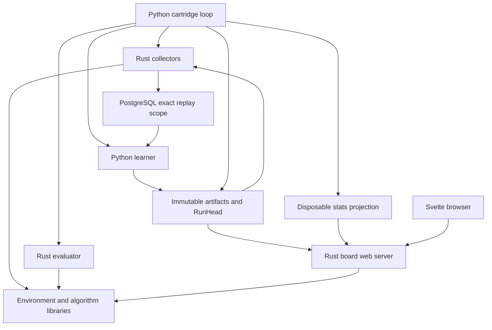

# Cartridge2 repository audit and focused remediation

Audit date: 2026-09-05. Audited base: `b4e94aa` on `main`.

This report was recreated from the audit text retained in the conversation after workspace maintenance removed the original file. Findings and verification results describe the original audit, not a new review of the current repository. The previously reported local remediation commit was `bde89b3`; publication was blocked by automatic approval review. Recreating this report does not restore or publish that code commit.

Six read-only specialist tracks reviewed engine/search, actor/replay, trainer/orchestration, artifact contracts, web/frontend, and infrastructure/dependencies/documentation. The lead reconciled findings and made every repository change. The audit used an isolated branch from fetched `main`, preserving the older checkout's unrelated deployment-plan edit.

## Architectural judgment

**Cartridge2 is becoming the right kind of system, but its end-to-end guarantees are weaker than its individual contracts suggest.** The Rust environment boundary, algorithm-owned collectors and learners, generated environment catalog, exact replay selection, and one mutable model authority are coherent. The installed DQN/Counter slice makes the separation of algorithms from board games concrete rather than hypothetical.

**It is not yet the simplest dependable implementation of that system.** The most expensive complexity is duplicated or uneven contract enforcement, repeated history validation, and launchers and consumers that have drifted from their producers. Strict types and canonical hashes protect identity; they do not prove that observations are sufficient, batches are sampled correctly, promotion evidence is checked everywhere, or users can see the emitted metrics.

The audit pass implemented three bounded improvements: correct and simplify replay sampling, propagate failed AlphaZero iterations to the CLI, and reconnect the dashboard to the current statistics contract. It added database and cross-language regression coverage and updated affected architectural guidance. It did not establish stronger trained-agent performance or make the entire repository production-ready.

## 1. Purpose, direction, and scope

| Category | What the repository establishes |
|---|---|
| Documented intent | An algorithm-oriented RL platform with independently registered environments and cartridges; local processes and shared storage replace Cartridge1's service RPC. The web interface supports training inspection and playing board-game models. Sources: README, CLAUDE, architecture reference. |
| Implemented at the audited revision | AlphaZero for TicTacToe, Connect4, Othello, and Generals; DQN for Counter; Rust simulation/MCTS/evaluation; Python learners; exact-profile PostgreSQL replay; filesystem/S3 artifacts; board-game web serving; tournaments and solver diagnostics; Compose and optional cloud manifests. |
| Explicit limitation | Generals training has not beaten random at the documented local compute scale. DQN is a narrow non-board slice. Generic ABI representation is broader than installed algorithm support. |
| Inference | The principal user is an experiment author who needs reproducible runs, clear diagnostics, and inexpensive addition of a compatible environment or algorithm. This is supported by tooling and examples, not a formal user research or product requirements document. |
| Not established | A multi-tenant hosted product, arbitrary-algorithm execution, production recovery objectives, distributed worker scheduling requirements, or evidence that another service or framework is needed. |

Central capabilities are collection, trustworthy experience, learning, evaluation, continuation, and inspection. Tournaments, solver scoring, cloud packaging, and W&B are useful supporting capabilities. They should not dictate the core environment or learner interfaces.

The plausible future requires versioned environment semantics, cartridge-specific behavior, stable storage contracts, and testable process boundaries. It does not require a registry/factory for every helper, a replay microservice, Kubernetes for local development, or a single generic loop that forces DQN into AlphaZero's champion semantics. Keep the working vertical slices and require the next real algorithm to justify the next generic extension.

## 2. Architecture and ownership map

The diagram shows dependency/data connections, not services that should be deployed separately. Engine and algorithm crates are libraries; collectors and evaluator are subprocesses. The frontend talks HTTP to web, never directly to PostgreSQL or model storage.

| Responsibility | Owner and boundary |
|---|---|
| Environment rules and authoritative position | Rust game/environment implementation, reached through validated `EngineContext`. State/timestep serialization stays at that boundary. |
| Agent/action/reward/episode semantics | `engine-core` capabilities, timestep, and private adapter validation. Board conventions belong to the narrow board profile. |
| Algorithm compatibility and identity | Canonical Rust algorithm descriptors and engine-generated manifest; Python registry binds concrete implementations. |
| Search policy and training-target semantics | AlphaZero/MCTS; raw visit targets are distinct from action temperature. DQN owns epsilon-greedy collection and Q targets. |
| Replay identity and persistence | `ReplaySelection` six-field fence and PostgreSQL transaction. Payload contents belong to the cartridge, not storage. |
| Episode lifecycle | Bounded actor; complete AlphaZero episodes are committed atomically, timeouts discard the episode and fail the worker. |
| Iteration lifecycle and recovery | AlphaZero's Cartridge2 orchestrator/run journal; Crucible contributes base facilities. DQN owns its separate bounded loop. |
| Learner/optimizer state | Cartridge learner plus validated immutable learner-state blob and manifest. |
| Current model authority | Sole mutable `models/channels/current.json` RunHead selecting immutable RunCommits/checkpoints. Collection uses latest; board serving selects champion or pre-promotion latest. |
| Promotion decision/evidence | Python evaluation recipe, result validation, EvaluationArtifact and RunCommit. Rust's reader enforces a weaker subset: finding F5. |
| Web game lifecycle | One process-local `GameSession` behind a lock, shared by every client. There is no user/session persistence layer. |
| Display metrics | Trainer emits finite named metric maps; stats JSON is a disposable projection; Rust API transports it; Svelte formats it. |
| Configuration | Typed Python and Rust config over shared defaults/TOML/env/CLI. Launcher defaults and trainer DSN handling still compete with this ownership: F8. |
| Retries and shutdown | Actor supervision and CLI/orchestrator for training; artifact backend for conditional publication/confirmation; watcher for web reload. These are separate failure domains. |

Runtime namespaces are `profiles/{algorithm}/{env}/v{environment_contract}`. PostgreSQL selections additionally bind experience schema, collection scope, and nullable source checkpoint. Preserve these distinctions: a game ID alone cannot identify compatible replay or model state.

## 3. Representative workflows

### AlphaZero collection through committed learning

1. Resolve algorithm/environment compatibility and requested authenticated RunRecipe before opening work.
2. Resolve RunHead and validated history. Finish a prepared publication if present; derive missing iterations.
3. Open a fresh replay scope bound to the latest source checkpoint. Launch bounded collectors with exact quotas.
4. Each collector validates compatibility and source identity, loads once, produces episodes through Rust rules/MCTS, and commits each complete episode's opaque records transactionally.
5. The parent waits for successful collectors and verifies the exact distinct-episode quota. The learner samples only that selection, validates envelopes and payloads, and computes gradient steps.
6. Stage the immutable checkpoint and exact stats snapshot. Prepare evaluation and champion evidence when scheduled.
7. Journal intent, publish immutable objects, validate lineage, then compare-and-set the sole RunHead. Rebuild projections from selected authority.

Source anchors: `actor/src/actor/setup.rs`, `actor/src/actor/episode.rs`, `actor/src/storage/postgres.rs`, `trainer/src/trainer/orchestrator/orchestrator.py`, `trainer/src/trainer/trainer.py`, and `trainer/src/trainer/storage/run_commit_repository.py`.

F1 sat inside step 5 despite surrounding identity checks. F2 turned failures in steps 4–5 into apparent command success. Those are independent failures of the same operational promise: a completed run should represent actual work on its intended evidence.

### DQN continuation

`dqn_loop.py` resolves the current checkpoint, allocates a fresh scope, collects discrete Counter transitions, trains Q-learning with a target network, advances checkpoint authority, and optionally prints return evaluation. Reinvocation runs another local `1..N` loop; epsilon and seeds restart their local schedule. Checkpoint continuity is implemented, but AlphaZero's authenticated global iteration target and evaluation-recovery semantics are not shared guarantees.

### Publication, restart, and rejected hot reload

Immutable blobs/manifests and a prepared journal can exist before a successful head advance. The prior head remains authoritative until CAS succeeds. AlphaZero restart can finish publication without regenerating experience. Web builds and validates a candidate evaluator before replacement and retains the last valid one after a rejected reload. These are valuable boundaries. F5 concerns incomplete evidence validation on the Rust reader, not absence of digest or tensor checks.

### Browser play and training inspection

The browser starts a game, submits a human move, and receives the bot reply from Rust search on the same engine rules. Search runs off the async executor, but the session remains process-local. Polling reads model information and stats through web. F3 prevented the latter flow from displaying the current schema; F7 remains a separate session/deployment problem.

## 4. Prioritized integrated findings

Priorities follow consequence. P0 means a correctness blocker for the affected claim/workload, not a security incident. P1 is a high-value structural or behavioral improvement; P2 is maintainability, operational, or verification debt; P3 is minor cleanup. Source locations refer to the audited base unless noted. “Fixed” means implemented in the original local audit commit, not merged or published.

### F1 — P0: replay sampling repeatedly selects a physical prefix — FIXED IN LOCAL AUDIT COMMIT

`trainer/src/trainer/storage/postgres.py:307–350` used `TABLESAMPLE SYSTEM` followed by `LIMIT`, with no random ordering. At up to ten minibatches per scope the percentage becomes 100. For 1,000 records and batch 256, the same physical first 256 rows can feed every step while later records remain unseen. Larger scopes retain physical-block bias. Both learners use this store.

The fix used one exact-fenced `ORDER BY RANDOM() LIMIT` query, removing the count and fallback branch. Empty selection raises; undersized selection fills only its shortfall with replacement. This simplifies ownership and control flow while keeping payload transfer bounded. PostgreSQL still scans the selected rows: this is a correctness-first choice, not a constant-time performance claim.

An added PostgreSQL integration regression checks that repeated batches reach more than one batch's distinct rows. The CI change provisions PostgreSQL so existing database tests no longer silently skip there. That CI execution was not verified during the audit.

### F2 — P0: failed AlphaZero work reports successful completion — FIXED IN LOCAL AUDIT COMMIT

At base `orchestrator.py:432–446`, learner exceptions became a failure tuple. Actor failure at `581–584` and learner failure at `606–607` returned `None`; `run()` treated that as ordinary termination and `cli.py:314–315` returned 0. Container/job automation could consider an incomplete experiment successful.

The fix reserved `None` for cooperative shutdown. Actor failure raises, learner errors propagate, and missing checkpoint/stats handoff is an error unless shutdown was requested. Existing `finally` cleanup and CLI status-1 handling remain. Regressions exercise the real orchestrator/CLI wiring, no-publication behavior, and cleanup for actor failure, learner failure, missing handoff, and requested shutdown.

### F3 — P1: statistics contract migrated without its browser consumer — FIXED IN LOCAL AUDIT COMMIT

`web/frontend/src/lib/api.ts:51–96` still declared flat losses, `last_eval`, and `eval_history`; Rust's actual DTO at `web/src/types/responses.rs:123–159` uses metric maps, `last_evaluation`, and `evaluation_history`. Cards showed missing losses/evaluation, both charts produced NaN coordinates, and hover formatting could fail. Baseline TypeScript check and build nevertheless passed.

The fix consumed the current wire shape directly. Cards render named metrics, known labels remain readable, arbitrary loss keys become chart series, and missing/zero/sparse values have explicit display behavior. Repeated total/policy/value path/tooltip code becomes series iteration. It introduced no compatibility DTO, new chart library, or test framework. Shared fixtures connect Python serialization, Rust response types, and real TypeScript client/chart/SSR behavior.

The fixture's DQN metrics protect generic presentation; this does not add DQN browser serving.

### F4 — P0: Generals' learner observation is not Markov-sufficient — DEFERRED, next correctness pass

Two distinct omitted facts can change the outcome of the same action:

- `engine/games-generals/src/obs.rs:72–85` encodes own/enemy armies but omits neutral defenders' armies. `movement.rs:37–49` reduces a neutral city's defenders after a failed attack. Defenders of 40 versus 1 therefore look identical to the network while the same attack can fail versus capture.
- Production occurs only after absolute seat 2 (`lib.rs:219–223`). The relative tensor has no production-phase indicator. With the parity-randomized cap, `(cap=399, seat=1, round=0)` and `(cap=400, seat=2, round=0)` can have identical relative board/round/countdown observations but different production after WAIT. The network receives the tensor, not the timestep agent ID.

This contradicts the declared perfect-information Markov learning input. It is a plausible contributor to poor learning, not proof of why previous runs underperformed; search budget and adjudication also matter.

Repair requires neutral-army and production-phase information, behavioral distinguishability tests, a Generals contract bump, regenerated catalog and shape expectations, and fresh compatible replay/models. That versioned cutover deserves its own verified change. Do not quietly alter the tensor under an existing contract.

### F5 — P1: Python and Rust disagree about valid promotion authority — DEFERRED

Python resolves evaluation evidence and derives champion transitions (`storage/run_commit_transition.py:413–425`). Rust reads RunCommits/checkpoints and validates evaluation references syntactically and structurally (`engine/model-watcher/src/artifact/filesystem.rs:105–125`, `artifact/lineage.rs:190–220`) but never loads EvaluationArtifacts.

Missing/corrupt evidence can make Python resume fail while Rust startup accepts the selected champion. The Rust test at `model-watcher/src/tests.rs:358–387` actually invents an evaluation digest and expects load success without materializing evidence. This is a confirmed contract difference, not a reproduced hostile exploit.

First specify the reader's evidence obligations and build Python-published artifacts consumed by Rust, including missing/corrupt evidence and unjustified transitions. Resolve that boundary deliberately; independently copying the full promotion validator would deepen the same duplication.

### F6 — P1: history verification repeatedly validates the same ancestry — DEFERRED

`RunCommitRepository.resolve_chain()` validates every edge (`run_commit_repository.py:118–124`); evaluated edges call `evaluations.list_evaluations()` over all prior evaluations (`run_commit_transition.py:422–425`, `evaluation_repository.py:125–162`). With evaluation each iteration, one N-commit resolution visits N(N+1)/2 evaluation ancestry entries, plus candidate manifests and other reads. Multiple publication/preflight paths repeat it. S3 turns these into serial remote reads.

The complexity is established by control flow; no wall-time benchmark was run. Use a request-scoped verified snapshot and linear traversals, preserving full corruption checks. Do not solve this by permanently trusting previously read mutable storage. This is the largest clear opportunity in artifact handling to reduce complexity without weakening authority.

### F7 — P1: web deployment has no coherent session ownership — DEFERRED

`web/src/startup.rs:114–119` creates one shared game; `k8s/base/web/deployment.yaml:17` runs two replicas behind a service without affinity. Requests can reach different boards. Even one replica lets users and tabs overwrite each other. This is topology conflicting with application ownership, not a reason for a new session microservice.

Choose the actual product scope. A supported single-user experimental deployment needs one backend and a deployment strategy that avoids overlapping independent sessions. Multi-user support requires explicit session identity and lifecycle. Affinity alone does not establish user ownership.

Related P2 lifecycle debt: returning from the chart remounts App and resets the game; Connect4 animation owns delayed request timing and can leave a failed move stuck; bot-search failure can leave the server after the human move with no retry path. Fix as one session/move-lifecycle change, not unrelated UI patches.

### F8 — P1: launchers compete with configuration authority — DEFERRED

`make setup` omits the evaluator build, `make train` does not forward its advertised PostgreSQL URL, and Make defaults to TicTacToe while checked-in settings target Connect4 with a temperature threshold invalid for TicTacToe (`Makefile:41,83,149–154`; `config.toml:168–173`). The real config loader reproduced that rejection. Compose and overnight scripts add more experiment-default copies.

Make launchers supply transport/deployment details and explicit user overrides; keep experiment defaults in the canonical config. Build both binaries required by the chosen workflow. Also align local feature gates with CI: actor `--all-features` includes Apple-only CoreML on Linux, while Make's Apple default contradicts the documented CoreML slowdown.

Frontend container startup is another P1 candidate: its non-root stock NGINX image does not relocate the default PID path (`web/frontend/Dockerfile:26–50`). This is a static finding consistent with [official unprivileged NGINX guidance](https://github.com/nginx/docker-nginx-unprivileged), not a locally executed container failure. Add a final-image runtime smoke test before declaring deployment functional.

### F9 — P1: accepted search temperatures can produce incorrect decisions — DEFERRED

`engine/mcts/src/tree.rs:165–181` exponentiates raw counts: f32 `[30,70]` at temperature .01 overflows both values. `engine/evaluator/src/player.rs:422–448` exponentiates probabilities: `[.6,.4]` at .001 underflows both to zero and then selects uniformly. A low-temperature setting intended to be near-greedy can therefore fail or become random. The f32 arithmetic was reproduced with platform `powf`; Rust callers were not executed for this finding.

Use stable scaling relative to the maximum positive weight and share the small numerical operation across callers. Preserve raw tau=1 training targets. Separately, search drops legal children with priors below `1e-8` before adding root noise (`search.rs:432–437`), so noise cannot restore suppressed actions. Retain legal exploration support and test with a deliberately overconfident wrong evaluator.

### F10 — P2: lifecycle ownership remains uneven — DEFERRED

- Disabling LR scheduling still applies warmup and never restores the configured optimizer rate (`lr_scheduler.py:149–151,176–177`). A configured .001 becomes .0001 with defaults. Existing tests assert constancy, not the requested value. This is a bounded correctness fix for an optional mode.
- ONNX export switches to eval before early input/output validation enters the restoration `try/finally` (`checkpoint.py:354–360,412`). Early rejection can leave mixed module modes changed. Add an early-error regression; the current test injects a later exporter error.
- DQN ignores a CAS confirmation that can return a newer descendant, then writes an older stats projection (`dqn_learner.py:275–281`). Durable authority remains safe; display state can regress.
- Fresh replay scopes accumulate without a retired-scope retention owner. Preserve exact-scope fences and define explicit inactive-scope maintenance rather than widening learner deletion.
- Cartridge2 inherits Crucible orchestration while overriding its main lifecycle and accessing private facilities. Prefer a later narrow process/lifecycle composition boundary once current ownership is documented; do not create a second generic orchestration framework.

### F11 — P2: verification and reproducibility need operational truth — PARTLY FIXED IN LOCAL AUDIT COMMIT

Real PostgreSQL CI configuration and shared stats fixtures were added. Remaining gaps include a Python security job that installs only `pip-audit` and audits its own environment, dependency ranges without a tested resolved Python lock, container build checks without startup checks, and no exercised backup/restore procedure. No new vulnerability claim is made by this audit.

The full Python suite in the available supported Torch 2.9 CPU environment also exposed three existing dynamic-batch ONNX export failures; the same tests failed on an untouched archive of `b4e94aa`. This reinforces the need for a documented tested dependency set. Do not silently suppress those tests.

Actor PostgreSQL URL parsing discards SSL/session options and connects through `NoTls` (`actor/src/storage/postgres.rs:298–333`); either support the promised URL semantics or explicitly reject unsupported requirements. Config debug logging includes override values, potentially including DSN credentials (`central_config.py:186`). These are concrete operational boundaries to address, not reasons for a database migration.

### F12 — P2/P3: documentation and small abstractions should follow ownership — PARTLY FIXED IN LOCAL AUDIT COMMIT

CLAUDE's one-cartridge/schema-v4 statements and the historical audit's claim to be a live backlog were corrected. The architecture reference separates AlphaZero and DQN workflow guarantees and documents the changed sampling/failure/statistics behavior.

Remaining P2: board execution derives actor/observer by building presentation views twice per transition (`engine-core/src/board_game.rs:178–181`). A cheap domain accessor would clarify direction; benchmark before claiming a significant speed improvement. Documentation still repeats some schema and deployment details across many files.

P3 examples: immutable current-game configuration sits behind a write lock; UI selection machinery assumes more game choices than the serving API allows; failed actor paths skip a final summary even though the failure event is logged. These do not deserve a broad cleanup before the correctness work above.

## 5. Why the pass selected these changes

| Selected improvement | Root cause removed | Verification added | Deliberate scope boundary |
|---|---|---|---|
| Random replay sampling | Premature block-sampling optimization violating learner expectations | Actual-database diversity regression; existing fence/schema tests configured in CI | No new sampler service, index migration, or retention policy |
| Failed-iteration propagation | One sentinel represented both shutdown and failed work | CLI failure status, no publication, resource cleanup, graceful shutdown | No change to recipe, journal, CAS, or recovery schema |
| Statistics consumer repair | Independent producer/consumer DTOs had drifted | One fixture checked across Python/Rust/TS; rendered chart and finite geometry tests | No legacy DTO, DQN web serving, session redesign, or chart dependency |

The changes improve the two most common user actions—running an experiment and inspecting its results—without changing model/replay identity. Generals observation repair and promotion-validator alignment have higher contract risk and larger required verification surfaces; they remain explicitly prioritized rather than being hidden inside this patch.

## 6. Technology, simplicity, and developer experience judgment

Keep Rust for simulation/search and Python/PyTorch for learning. The ONNX boundary earns its existence. Keep engine-owned rules and the generated catalog; deleting the old Python game mirrors was a substantial improvement. PostgreSQL is appropriate for concurrent writers and needs a correct sampler, retention policy, and live tests, not replacement. Filesystem models are the sensible local default; S3 and Kubernetes should stay optional.

The strongest code is cohesive despite some large files: concrete game rules, strict artifact codecs, and explicit replay envelopes. The clearest simplification opportunities are semantic duplication across consumers, repeated immutable history traversal, launcher defaults, and inheritance that no longer owns the inherited lifecycle. Splitting files or adding factories does not resolve those issues.

Test investment should follow failure mechanisms: semantic observation pairs, sampler diversity, cross-language published fixtures, command exit status, multi-request session workflows, and container startup. More tests that deserialize a type into itself will not protect the missing boundaries.

## 7. Verification record from the original audit

- Targeted Python storage/orchestrator/shared-wire tests: **117 passed, 10 skipped**. Database-dependent tests were the ten local skips. All three new failed-iteration regressions were also run with the original orchestrator module and failed as expected; they passed with the patch.
- Full Python suite: **774 passed, 13 skipped, 3 failed**. The failures were `TestArbitraryChannels::test_onnx_export_signature[2]`, `[9]`, and `test_generals_v3_deep_resnet_export_passes_runtime_equivalence`. All three also failed on an untouched `b4e94aa` archive in the same environment, with Torch dynamic-batch constraint errors. They were not introduced by the patch.
- Runtime: Python 3.10.20, Torch 2.9.0+cpu, ONNX 1.22.0, ONNX Script 0.7.1, ONNX Runtime 1.23.2; Crucible at the repository's pinned `d7eb32c2`.
- Ruff check and formatting: passed across trainer source/tests/smoke test.
- Frontend: four Node/Vite regression tests passed; Svelte check reported zero errors/warnings; production build passed. Existing baseline check/build also passed despite the original runtime schema defect.
- Rust web formatting and `cargo clippy --locked --manifest-path web/Cargo.toml --all-targets -- -D warnings`: passed. Clippy used the ORT build script's download-skip setting because it only type-checks. The shared-fixture test could not link/run: the required ONNX Runtime 1.28 download endpoint refused the connection. The new test was compiled by Clippy and included in the normal CI Rust test job; it was not executed locally.
- Local PostgreSQL execution, browser interaction, container startup, deployment, model-strength experiments, and GPU training were not performed. PostgreSQL CI was configured in the local commit; a skipped local integration test is not reported as a pass.

These are historical execution results preserved from the conversation. No tests were rerun while recreating this report.

## 8. Recommended next sequence

1. Correct Generals observation sufficiency with a versioned contract change and behavioral tests. Validate neutral defense and production timing before another training-strength experiment.
2. Establish Python→Rust artifact-reader conformance and linear request-scoped history verification. Define exactly what serving must prove before selecting a champion.
3. Stabilize temperature scaling and restore all legal root exploration support; separately fix disabled-scheduler and early-export mode restoration bugs with focused tests.
4. Repair launcher/config ownership and declare the supported single-user web topology. Prove setup, training failure, image startup, and new-game→move workflows on real processes.
5. Narrow Crucible lifecycle coupling, add inactive-scope retention and backup/restore guidance, and establish reproducible dependency resolution after the correctness boundaries are dependable.

Do not begin a framework rewrite. The project has useful boundaries worth preserving; the next advances should make those boundaries tell the same truth.
